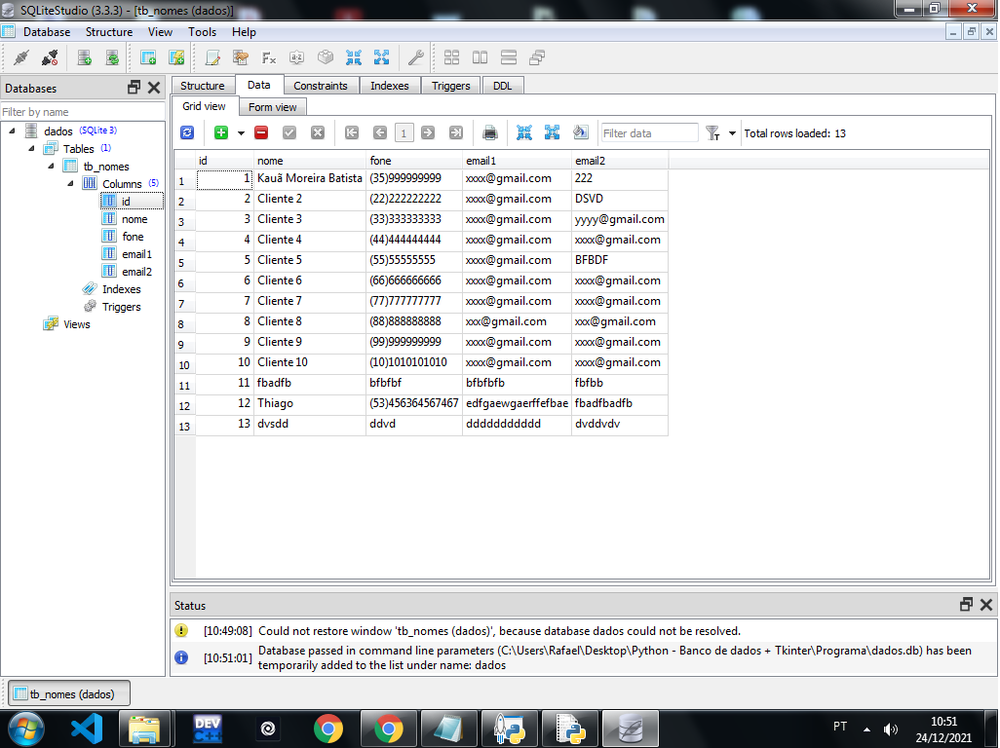
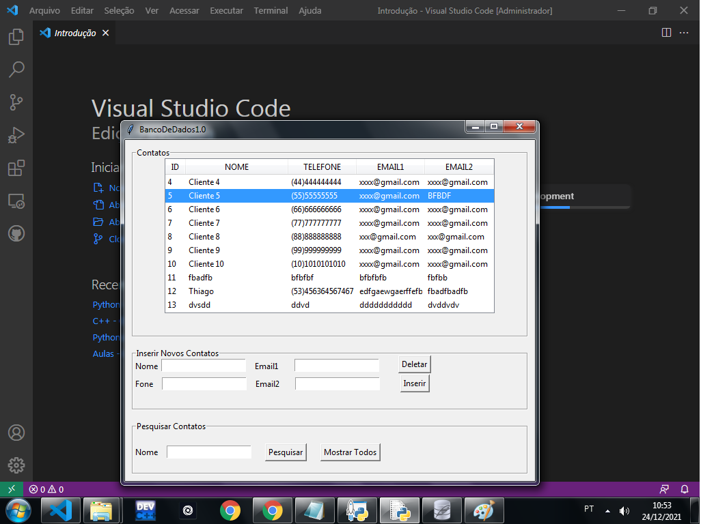
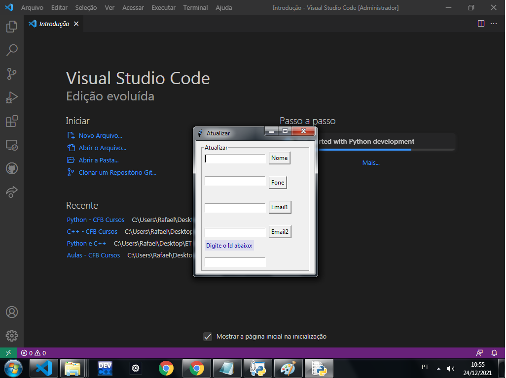

<h1> Python: SQLite + Tkinter </h1>

<h3> Objetivo do projeto: </h3>
<h5>Esse projeto foi feito pensando em fazer a integração de um banco de dados e uma interface gráfica, que possibilita o usuário inserir, deletar, pesquisar e atualizar dados de clientes.
 Linguagem: Python.
 Banco de dados: SQLite.
</h5>
<h1></h1>
<h3> Bibliotecas usadas: </h3>
<h5>
<li> import   tkinter
<li> import   os 
<li> import   messagebox 
<li> import   sqlite3 
<li> import   Error 
</h5>
<h1></h1>
<h3> Imagens: </h3>

<h5>
<li>SQLite:
   

  
<li>Interface gráfica 1:
   

  
<li>Interface gráfica 2:
   

<h1></h1>
</h5>
<h3> Demais avisos: </h3>
<h5>O projeto foi criado na intensão de treinar as habilidades referentes à condicionais simples, tratamento de erros, banco de dados, interface gráfica, uso de funções e bibliotecas, linkamento de outros arquivos python dentro de um programa e outros. 
Foi usado duas interfaces diferentes por questões estéticas e de funcionamento. Qualquer dúvida entre em contato.
</h5>
